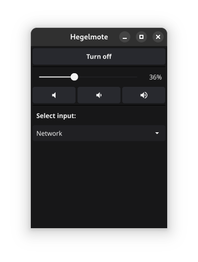

# Hegelmote

This Go package allows remote IP control of Hegel amplifiers.
It connects using tcp to the address and port of the amplifier and allows sending commands to control parameters like power, input and volume.

The idea for this stems from wishing to create a free and open source alternative to [Hegel Remote](https://apps.apple.com/ca/app/hegel-remote/id1562489978). It also supports more devices than the official [Hegel Control app](https://support.hegel.com/product-articles/hegel-setup-app).

While limited in functionality at the moment, the goal is to expand with better cli and gui offerings in the future.

**NOTE**: We are not repsonsible for any damage to your equipment. This package is an unofficial app for controling the amplifiers and is in no way affiliated with the company [Hegel](https://www.hegel.com/en/).

## Application

There is currently a graphical interface in development as well. It is considered experimental for the moment. It is hardcoded to Hegel H95 at the default address and port.

  

## Supported Amplifiers

This software has only been tested on Hegel H95 but the list of supported models should be as follows according to the documentation:

- Röst
- H95
- H120
- H190
- H390
- H590

### Might work (untested)

- H190v

## Sources
- **IP control command and Input table:** https://support.hegel.com/component/jdownloads/send/3-files/102-h95-h120-h190-h390-h590-ip-control-codes
- **Hegel Röst IP Control Codes:** https://support.hegel.com/component/jdownloads/send/3-files/16-roest-ip-control-codes
