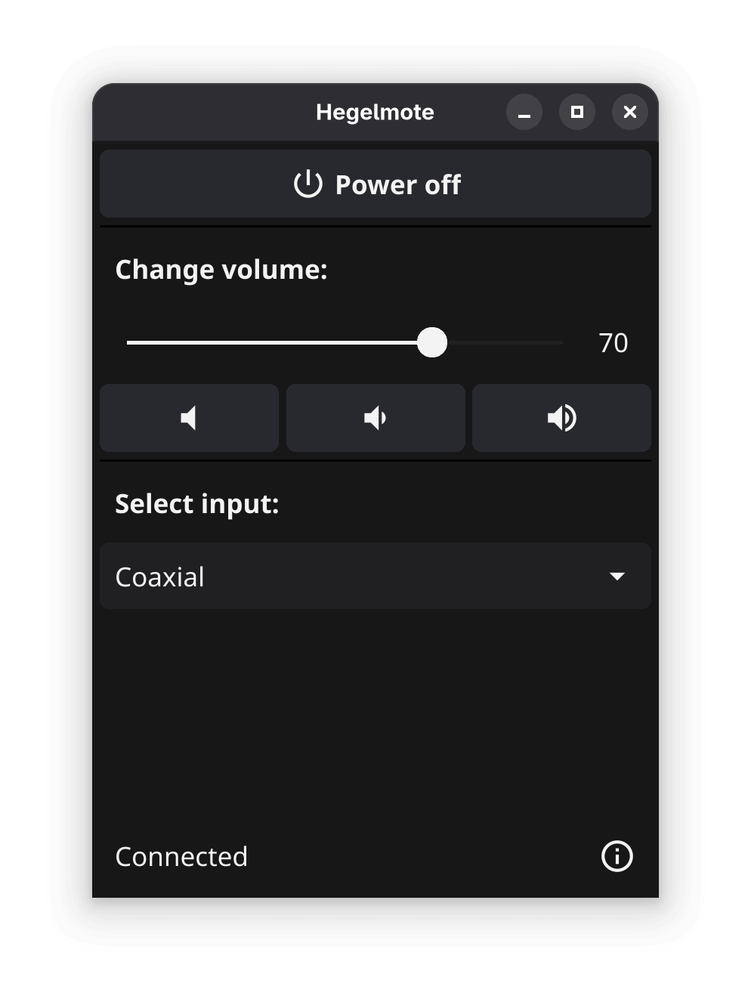

# Hegelmote

Hegelmote is a graphical application that lets you control Hegel amplifiers remotely. It connects using TCP to the amplifier and allows changing settings like power, input and volume.
It also provides a Go module API that can be used to integrate Hegel amplifier control into other projects.

  

The idea is to create a free and open source alternative to [Hegel Remote](https://apps.apple.com/ca/app/hegel-remote/id1562489978) that is entirely free of telemetry. It also supports more devices than the official [Hegel Control app](https://support.hegel.com/product-articles/hegel-setup-app).

**NOTE**: We are not responsible for any damage to your equipment. This package is an unofficial project for controling the amplifiers and is in no way affiliated with the company [Hegel](https://www.hegel.com/en/).

## Supported Amplifiers

This software has currently only been tested on `Hegel H95` but the list of supported models should be as follows according to the documentation:

- Röst
- H95
- H120
- H190
- H190V
- H390
- H590

## Installing

Release binaries for Linux, macOS, Windows and FreeBSD (plus experimental Android builds) can be downloaded [here](https://github.com/Jacalz/hegelmote/releases/latest).
The recommended installation method for Linux is to use the Flatpak package from Flathub:

## Experimental WASM build

In the `cmd/webmote` folder, there is an experimental proxy server that runs locally with access to the amplifier and then allows the application to communicate to it over WebSockets when running sanboxed in the web browser.

## Sources
- **IP control command and Input table:** https://support.hegel.com/component/jdownloads/send/3-files/102-h95-h120-h190-h390-h590-ip-control-codes
- **Hegel Röst IP Control Codes:** https://support.hegel.com/component/jdownloads/send/3-files/16-roest-ip-control-codes
